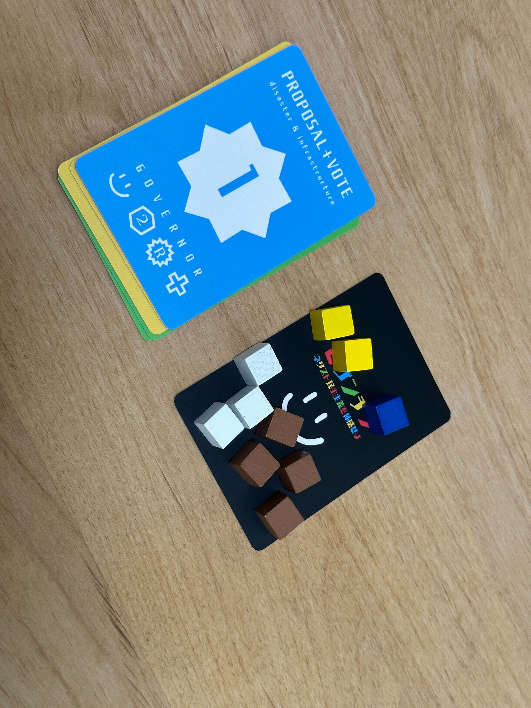

# byzantine

## はじめに

ビザンチン -ネクスト民主主義を体験せよ-
は「トリックテイキング」を基本とした2-4人向けのゲームです。
プロポーザルの提案、ステーキング、投票などを行いながらDAOの流れを擬似体験できるゲームになっています。カードの示す色は様々な社会課題になっており、プレイヤーはこうした社会課題に対して様々なプロポーザルを行うことでゲームを進めていきます。

うまくプロポーザルを通過させた勝者は「社会の幸福度」が手に入りますが、この累計値によって勝敗が決まります。また、プロポーザルを通過させるだけではなく、ステーキングという行為によって得点を稼ぐこともできるため、プロポーザルを通過させる見込みがない場合には、ステーキングも活用しながら得点を得ることが必要となります。分散型の仕組みにおいて独占的な動きは御法度になります。ラウンドの中で、勝利できる回数の上限は決まっており、特定の回数以上勝利を収めてしまったプレイヤーは独占的とみなされ、その時点でラウンドは負けとなってしまいますので、プロポーザルを通過させる回数には注意が必要です。

## トリックテイキングとは

トリテとは「全員が順番にカードを出し、全員が一枚ずつカードを出したところで、出されたカードに対し、カードの強弱に基づき勝ち負けを決める」というミニゲームをことを繰り返すゲームシステムです。勝ち負けを決めるミニゲームのことをトリックと呼びます。トリックに勝つことをトリックを「取る（テイク）」といいます。このトリックを何回も繰り返し、最終的な総合得点などでゲーム自体の勝敗を決めます。

## カードの表記について

(カードの色と枚数)

各色8枚が用意されており累計で32枚のカードがあります。

| 色 | 意味 |
| ------------- | ------------- |
| 赤  | population decline(人口減少)  |
| 青  | Disaster & Infrastructure (災害とインフラ)  |
| 黄  | Information Society (情報化社会)  |
| 緑  | Healthcare and Social-welfare (医療と社会福祉)  |

(カードの数字)

数字が投票における強さとなる

(ガバナーの意味)

左から
1.勝利によって得られる得点(社会の幸福度)
2.ステーキングできる個数(この図では-となっておりステーキング不可)
3.選挙の種類

| - | 名前 |意味 |
| ------------- | ------------- |------------- |
| S  | Single Choice Voting| 最も数字が大きいカードが強い|
| R  | Ranked Choice Voting  |2番目に数字が大きいカードが強い |
| Q  | Quodratic Voting  | 最も数字が小さいカードが強い|

4.優先される社会課題のテーマ(切り札の色)
(この図の場合は、赤ではなく透明の扱いとなり、切り札はない)

## 遊び方

### howtoplay

簡易版の遊び方マニュアルです。印刷して配っておくと便利です。

### 初期設定

1.じゃんけんで親を決める
2.7枚ずつカードを配布、トークンを複数配布する(トークンは人ごとに色が異なるように)
3.残りの山から1枚を選び、中央にカードを寝かせた状態で配置する。これが「ガバナー」となる。
(ガバナーには、左から勝利した際の得点、ステーキング可能な数、投票のルール、切り札の色が書かれており、プレイはルールに従う。)

### ゲームの流れ

#### 1.プロポーザルの提出
最初に、親が「ガバナー」に対して、「プロポーザル」を提出する。
カードを1枚、どの色、どの数字でも良い。

#### 2.投票
右回りに「プロポーザル」に対して「投票」をしていく。
親が出した「プロポーザル」と同じテーマの色のカードのみ投票に使うことができる。(トリックテイキングでは、マストフォローというルールで呼ばれる。）
ガバナーに書かれている勝利条件によって、その場の一人だけが勝者となり、プロポーザルを成功させることが可能となる。
勝利条件は、
Single Choice Voting...場のカードの中で最も大きな数字の書かれてるカード
Ranked Choice Voting...場のカードの中で2番目に大きな数字の書かれてるカード
Quadrativ Voting...場のカードの中で最も小さな数字の書かれてるカード
となる

#### 3.ステーキング
カードを出さずに、ガバナーに書かれているステーキングの個数を場に出すこともできる。ステーキングについては後述。
ステーキングの数が0の場合はステーキングすることはできない。

#### 4.切り札(価値の上昇)
ガバナーの一番右に書かれているのは、最も今、必要とされているテーマのカラーである。
(トリックテイキングのルールでは切り札と呼ばれる）
プレイヤーは自身がプロポーザルに応じた投票の色を持っていない場合に限って、切り札を出すことができ、この切り札のカードは他のカードよりも強い。

#### 5.勝利
勝者は「ガバナー」に置かれているカードを受け取り、上下逆さまにして自分の近くに置く。
さらに、勝利となったカードを中央に寝かせた状態でセットして、このカードが次の「ガバナー」になる。
前回プレイの勝者が親となり、再度プロポーザルを提出するところからスタートする。

### 6.終了条件
7枚のカードを使い切ったら終了となる。
また、人数に応じて、特定回数以上、勝利した場合、"独占"となって無条件に負けとなりその時点で離脱する。独占の条件は 2人->5回 3人->4回　4人->3回

### 7.ステーキングによるポイント

ステーキングは、各者、条件によって特定の枚数のトークンを置くことができる。
終了時にステーキング数に応じて、得点がプラスされる。
1位 5point 2位 3point 3位以降は0pointとなる

### 最終スコアの計算
スコアの計算は
手元にあるカードのガバナーに書かれている点数の累計 + ステーキングによるポイント(7を参照) - 手元に残っているカードの数
で算出される。もっとも得点の高い人が勝利となる。

## 参考プレイ

例えば、親が1を出した場合に、右回りに同じ色のカードを出していく。
もし同じ色がなければ、他の色を出しても良いが、数字の大きさに関わらず負けとなる。
この図では、赤の7が勝者となる。

この図では、ガバナーの優先されるテーマの色が黄色となっているため、黄色の1が勝者となる。
ただし、黄色を出しているプレイヤーの手元には赤がないことが前提となる。

この図では、親が青の3を出したと仮定して、2名のプレイヤーは、カードを出すことを放棄して、ガバナーに書かれているステーキングを2追加したことになる。
最終的にステーキングに溜まった駒の数が多い人から順位付けされて1位には5点、2位には3点が加算される。

